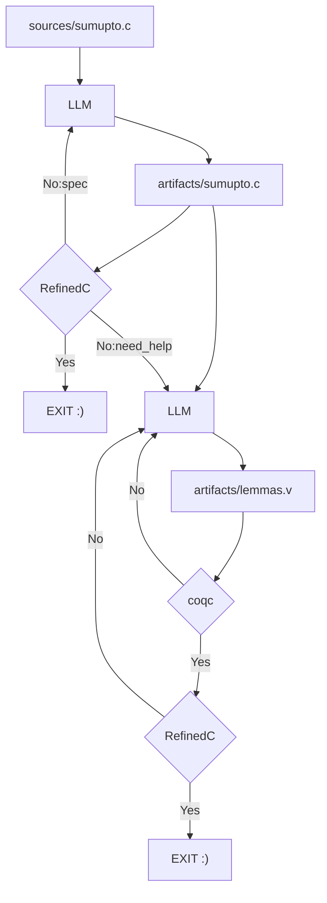

# RefinedC Copilot

_Towards a Copilot for [RefinedC](https://gitlab.mpi-sws.org/iris/refinedc)_

## Development

The `.envrc` file assumes that you've already made an opam switch called `refinedc-projects` as defined in the [RefinedC readme](https://gitlab.mpi-sws.org/iris/refinedc#setting-up-an-opam-switch-optional) (which also has `coq-lsp` added!), as well as having nix installed. If you don't want to use `direnv`, then run `eval $(opam env --switch refinedc-projects)` as well as installing `uv` and `pnpm`.

## Directories

This is a prototyping process with some false starts

### `scaffold`

This is a take with `pydantic-ai`. To make a vscode extension, we'd have to vendor the uv package somehow.

### `vscode`

This is a take with `fp-ts`. It wants to eventually be a vscode extension.

### `vscode2`

This is a take with `effect` and `mcp`. It too wants to eventually be a vscode extension.
